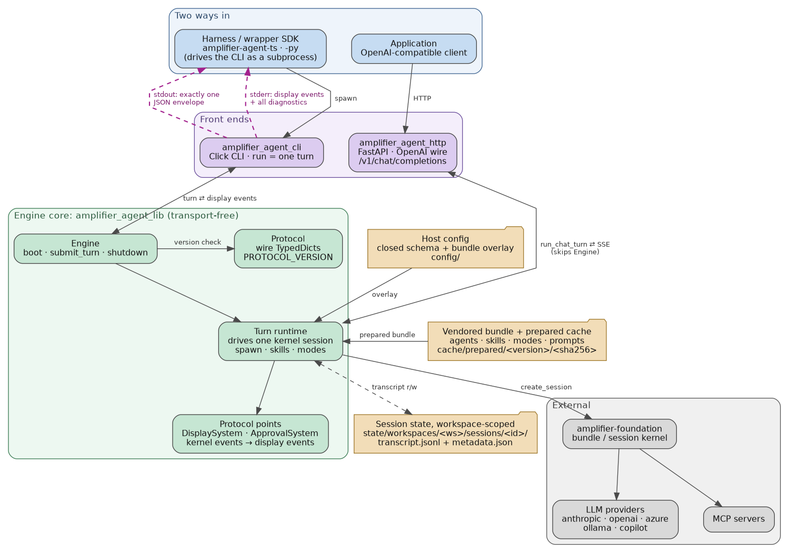

# Architecture

Amplifier Agent is the expert layer between a harness and a model. Not the model and not
the harness: the operational expertise in between, packaged so that it travels. How a goal
gets framed, how the work gets checked, when a human is genuinely needed, which model gets
which piece of work. Swap the harness, swap the model, keep the layer.

This repository is the engine for that layer. It wraps the amplifier-foundation
bundle/session kernel in an opinionated, vendored agent environment and exposes it through
two front ends, because there are exactly two ways the layer is consumed:

```
one   inside an application you are building
two   inside a harness you already use
```



Source: `architecture/architecture.dot`. Regenerate with:

```bash
cd docs/architecture && dot -Tpng architecture.dot -o architecture.png
```

## Two ways in, two front ends

The two ways in want different shapes. That is the whole reason there are two front ends
rather than one.

**A harness you already use** owns the loop, the UI, and the user's session. It is not going
to be rewritten to accommodate a new backend, so the layer has to arrive in a protocol the
harness already speaks. `amplifier_agent_http` is that: one long-lived FastAPI process on
the OpenAI chat-completions wire. OpenCode reaches the layer this way today.
`amplifier-app-opencode` spawns `amplifier-agent serve chat-completions` and registers it as
an OpenCode provider. There is no fork of the harness; the layer goes underneath it.

**An application you are building** owns the product and wants the layer as a dependency it
calls, not a service it has to operate. `amplifier_agent_cli` is that path's substrate: `run`
executes exactly one turn against argv and prints exactly one JSON envelope on stdout, with
display events on stderr. One process per turn, nothing to keep alive. The wrapper SDKs in
`wrappers/typescript` and `wrappers/python-py` drive that subprocess and present it as a
typed function call, so the application owns no server lifecycle and no port. An application
that already speaks OpenAI-compatible HTTP can point at the server instead.

Neither front end carries agent behavior. Both are adapters over the same
`amplifier_agent_lib` runtime, which is what makes "the same expertise on both paths"
mechanical rather than aspirational.

## The three packages

```
src/amplifier_agent_lib/    the engine core, transport-free
src/amplifier_agent_cli/    the Click front end
src/amplifier_agent_http/   the FastAPI front end
```

**`amplifier_agent_lib`** owns everything that is not transport: the `Engine` lifecycle,
the turn handler that builds and drives a kernel session, the vendored bundle and its cache,
the host-config schema, workspace path math and session storage, the wire protocol types,
and the policy modules (spawn, skill dispatch, mode resolution).

It is transport-free. It never reads stdin and never writes stdout. All output leaves
through the `DisplaySystem` injected at construction, and all approval requests through the
`ApprovalSystem`. This is a mechanical invariant, not a convention:
`tests/test_stdout_discipline.py` fails the build if any executable line in the package
calls `print(` or references `sys.stdout`.

**`amplifier_agent_cli`** is a thin adapter. It parses argv, loads config, picks a provider,
constructs the concrete display and approval implementations, calls the engine, and writes
the envelope. It owns stdout discipline, exit codes, and the audit trail. It owns no agent
behavior.

**`amplifier_agent_http`** translates between the OpenAI chat-completions wire and the same
runtime. It prepares the bundle once at lifespan and reuses it across requests, routes each
request's `model` field to a provider, drains a display queue into SSE chunks, and serves
`/v1/models`, `/v1/skills`, and `/v1/modes` from the same helpers the CLI admin subcommands
use. It does not go through `Engine`; it calls the runtime directly via `run_chat_turn`.

## Where the expertise lives

The layer's value is not the plumbing above, it is what the plumbing carries. Four pieces of
it are visible in the architecture.

**Which model gets which piece of work.** `provider_sources.inject_routing_matrix` rewrites
the `hooks-routing` module's `default_matrix` to the matrix that matches the active provider,
at the same seam where provider credentials resolve. The caller names one provider; the layer
decides that a git operation does not need the most expensive model in that provider's
catalog. Injection is per invocation rather than baked into `bundle.md`, because the bundle
is sealed and cached by content hash and a templated bundle would break that.

**When a human is actually needed.** `ApprovalSystem` is one of the two protocol points the
engine takes at construction, which is what makes the seam pluggable per front end. The CLI
supplies `CliApprovalSystem` and resolves its mode from argv, then host config, then TTY
detection, then fails fast with `approval_unconfigured` rather than guessing on a headless
run. The HTTP face deliberately has no human seam: a chat-completions request has nowhere to
put a question, so `approval.mode` is not applied there rather than being silently defaulted.

**The packaged expertise itself.** `src/amplifier_agent_lib/bundle/` is the content of the
layer: `bundle.md` plus the agents, skills, modes, context, and system prompt it references,
all shipped inside the wheel. There is no user-supplied bundle, and that is the point. What
varies between hosts is configuration, not the agent environment, so every host gets the
same expertise.

**Your own expertise goes in alongside.** The bundle is opinionated, not sealed. Host
config's `skills.skills` is a list of source URIs mounted next to the vendored skills, and
`skills.visibility` controls what the model sees of the combined set. The closed-schema
loader validates the shape of that block at startup so a typo fails loudly instead of
quietly dropping a caller's skills.

## Key decisions

**Transport-free core.** The engine takes protocol points as constructor arguments and knows
nothing about pipes, sockets, or SSE. Both front ends and every test harness plug in their
own. Without this the subprocess protocol would be unimplementable, and the two ways in would
drift into two different agents.

**TypedDicts are the wire spec.** `src/amplifier_agent_lib/protocol/` holds the authoritative
type definitions. `protocol/_gen.py` generates `protocol/spec.md` and
`protocol/schemas/*.schema.json` from them, and `tests/test_protocol_gen_staleness.py` fails
when the checked-in output drifts. Documentation never restates the schemas; it points at
the generated artifacts.

**Version plus content keyed pickle cache.** The prepared bundle is pickled to
`~/.amplifier-agent/cache/prepared/<version>/<sha256(bundle.md)[:16]>/`. Bumping the package
version or editing `bundle.md` changes the key, so the cache self-invalidates and no
cache-clear step exists in any workflow. Corruption is treated as a miss and rebuilt.

**Workspace-scoped state.** All session state lives under
`~/.amplifier-agent/state/workspaces/<slug>/sessions/<id>/`. The slug comes from
`--workspace`, then `AMPLIFIER_AGENT_WORKSPACE`, then a deterministic derivation from the
cwd that matches `amplifier-app-cli`'s `project_slug` byte for byte, so ecosystem hooks
bucket identically regardless of which host launched the session.

**Closed host-config schema.** The loader rejects unknown top-level keys rather than ignoring
them. A typo in a config file is an error at startup, not a silently dropped setting.

**Strict protocol version equality.** Wrapper and engine must report the same
`PROTOCOL_VERSION`. There is no support window and no negotiation. The escape hatch is
`allowProtocolSkew: true` in host config, and it is documented as unsafe.

## Where things live

```
src/amplifier_agent_lib/          engine core (transport-free)
  engine.py                       boot / submit_turn / shutdown / dispatch
  _runtime.py                     make_turn_handler, prepare_bundle_for_session
  protocol/                       wire TypedDicts, PROTOCOL_VERSION, _gen.py,
                                  generated spec.md + schemas/
  protocol_points/                DisplaySystem / ApprovalSystem protocols and the
                                  CLI + HTTP default implementations
  bundle/                         vendored bundle.md, agents, skills, modes, context,
                                  loader, pickle cache, streaming hook, host-tool proxy
  config/                         closed host-config loader and the mount-plan merger
  persistence.py                  path math and workspace slug rules
  session_store.py                transcript.jsonl + metadata.json
  incremental_save.py             tool:post transcript checkpointing
  migration.py                    legacy on-disk layout migration (user-invoked)
  spawn.py                        session.spawn policy and agent overlay hydration
  skill_dispatch.py               !amplifier:skill sigil dispatch
  mode_resolution.py              mode name resolution and discovery

src/amplifier_agent_cli/          Click front end
  __main__.py                     the command group and subcommand registration
  modes/single_turn.py            the `run` command, envelope, exit codes, audit
  admin/                          doctor, prepare, verify, migrate, version, update,
                                  config, cache, models, skills, modes, serve, auth,
                                  providers
  provider_sources.py             provider catalog, injection, credential resolution,
                                  routing matrix selection

src/amplifier_agent_http/         FastAPI front end
  app.py                          app factory and the one-time lifespan
  routes/                         chat_completions, models, skills, modes
  _session_runner.py              run_chat_turn, the per-request kernel session
  _event_translator.py            display events -> OpenAI chunk shapes
  _wire.py                        request models and SSE chunk builders
  _auth.py                        bearer token dependency
  _reconciler.py                  client history reconciliation

wrappers/
  typescript/                     amplifier-agent-ts SDK
  python-py/                      amplifier-agent-py SDK
  conformance/                    shared fixtures and cross-language parity runners

tests/                            unit and integration tests, mirroring src/ layout
  cli/  http/  config/  bundle/   per-package suites
  integration/                    multi-component tests
  e2e/                            DTU-based end-to-end framework and suites

docs/                             this directory
```

## Pointers

- `docs/SPEC.md` for the contracts: CLI surface, envelope and error codes, wire
  protocol, engine API, host config, storage layout, bundle and cache, providers and
  models, skills and modes, HTTP face, wrapper contract, install and distribution.
- `docs/E2E_TESTING.md` for the DTU-based end-to-end framework and how to add a suite.
- `docs/LAYERS_AND_RELEASES.md` for which layer a change lands in and what it means for
  releases.
- `architecture/data-flows.md` for step-by-step traces of the CLI turn, the HTTP chat
  completion, and the wrapper subprocess, with file and line references.
- `src/amplifier_agent_lib/protocol/spec.md` is generated, not written. It is the
  authoritative description of the wire shapes.
